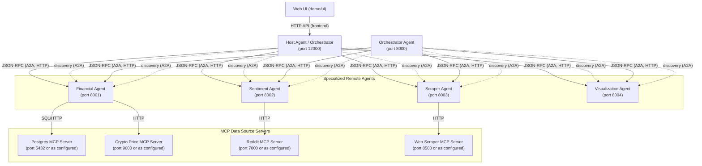

# A2A + MCP: Multi-Agent Financial Analysis System

This repository demonstrates a practical, real-world implementation of Google's **Agent-to-Agent (A2A)** protocol combined with Anthropic's **Model Context Protocol (MCP)**. Together, these open standards enable seamless interoperability between modular AI agents.

## Architecture

### Port Reference Table

| Component             | Default Port | Notes                                  |
|-----------------------|-------------|----------------------------------------|
| Web UI (demo/ui)      | (N/A)       | Runs in browser, connects to HostAgent |
| Host Agent            | 12000       | Main orchestrator for UI               |
| Orchestrator Agent    | 8000        | Generic A2A orchestrator, API testing  |
| Financial Agent       | 8001        |                                        |
| Sentiment Agent       | 8002        | Example; adjust as configured          |
| Scraper Agent         |             | Example; adjust as configured          |
| Visualization Agent   | 8004        | Example; adjust as configured          |
| Postgres MCP Server   | 5432        | Standard Postgres port (can vary)      |
| Crypto Price MCP      | 9000        | Example; adjust as configured          |
| Reddit MCP            | 7000        | Example; adjust as configured          |
| Web Scraper MCP       | 8500        | Example; adjust as configured          |

- The Host Agent and Orchestrator Agent both orchestrate flows, but the Host Agent integrates with the UI, while Orchestrator Agent can be used for API-first or direct A2A agent chaining/testing.
- MCP servers supply data to the Financial, Sentiment, and other Remote Agents.

## 🌟 What Does This Project Do?

We built a multi-agent system designed for financial market research, sentiment analysis, data scraping, and data visualization. Users interact through a streamlined UI, asking questions about crypto or market trends. Under the hood, requests are delegated to specialized agents via A2A, each powered by contextual data from MCP servers.

---

## 📌 Architecture Overview

- **UI Orchestrator (A2A Client):** Accepts user queries and forwards them using the A2A protocol.
- **Remote Orchestrator (A2A Server):** Delegates incoming tasks to specialized agents.
- **Specialized Agents:**

  - **Financial Agent:** Fetches crypto prices from local (Postgres MCP) and remote (CoinCap MCP) sources.
  - **Sentiment Agent:** Analyzes market sentiment using the Reddit MCP server.
  - **Scraper Agent:** Gathers additional market data through a Web Scraper MCP.
  - **Visualization Agent:** Prepares and generates visual charts.

All components communicate via standardized JSON-RPC (A2A) and access data via MCP.

---

# 🚦 Getting Started

Clone the repository:

`git clone https://github.com/anshulLuhsna/a2a_with_mcp.git`

`cd a2a_with_mcp`

Note: Each agent (and each MCP server) has its own requirements.txt. This keeps dependencies lightweight and fully modular.

Install dependencies per component—e.g.:

### Financial Agent deps

`pip install -r agents/financial_agent/requirements.txt`

### Sentiment Agent deps

`pip install -r agents/sentiment_agent/requirements.txt`

### Scraper Agent deps

`pip install -r agents/scraper_agent/requirements.txt`

### Visualization Agent deps

`pip install -r agents/visualization_agent/requirements.txt`

### Remote Orchestrator deps

`pip install -r agents/orchestrator_agent/requirements.txt`

### UI dependencies

`pip install -r demo/ui/requirements.txt`

(Feel free to create a virtualenv or conda env first.)

🚀 Running the Demo

Run Agents:

## Manually start each agent, e.g.

`python -m agents.orchestrator_agent`
`python -m agents.financial_agent`
`python -m agents.sentiment_agent`
`python -m agents.scraper`
`python -m agents.visualization_agent`

Start the UI:

`cd demo/ui`
`uv run main.py`

Open the UI at http://localhost:8501

---

## 📚 Resources & Documentation

- [A2A Protocol (Google)](https://github.com/google/A2A)
- [MCP Documentation (Anthropic)](https://docs.anthropic.com/en/docs/agents-and-tools/mcp)

---

## 📜 License

This project is licensed under the MIT License. See [LICENSE](LICENSE) for details.
